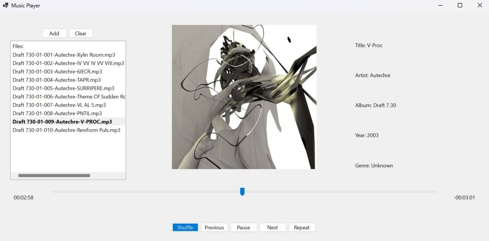

# Music Player App



## Overview
A simple, user-friendly music player built with C# using Windows Forms. It's designed to provide a seamless and intuitive experience for playing your music library.

## Features
- **Add Files**: Quickly add to the playlist from a file menu and get more without interrupting play. Clear button for starting new playlist.
- **Interactive Trackbar**: Move back and forth through a track by clicking and dragging along a timeline. Elapsed and remaining times indicated.
- **Intuitive Contols**: Play, pause, previous, next and repeat function as expected. Shuffle feature for moving randomly through the playlist. 
- **Album Artwork**: Corresponding JPEG or PNG files displayed centrally for each track and a placeholder image for when image files are not found. 
- **Resizable Window**: Layout of control elements dynamically responds to to custom resizing. 
- **Metadata**: Title, artist, album, year and genre clearly displayed. 
 
## Installation

To run the Music Player app on your Windows machine, follow these steps:

1. **Install .NET Framework**: Ensure you have the .NET Framework installed on your computer. If it's not already installed, you can download it from [Microsoft's .NET website](https://dotnet.microsoft.com/download).

2. **Clone the Repository**: Clone this repository to your local machine using Git or download the ZIP file and extract it.

3. **Install NAudio and TagLibSharp**: Open the solution in Visual Studio (or your preferred C# development environment). NAudio library is used for audio processing. You can install version 2.2.1 via NuGet in Visual Studio with the following command: 

    ``` Install-Package NAudio -Version 2.2.1 ```

    For reading metadata (tags) of audio files, TagLibSharp is used. Install version 2.3.0 via NuGet using:
    
    ``` Install-Package TagLibSharp -Version 2.3.0 ```

4. **Compile and Run**: Compile the project then run the application.

5. **Start Using the App**: Once the app is running, you can start adding music files to your playlist.

## Contributing

If you'd like to contribute to the development of this app, feel free to fork this repository, make improvements, and submit a pull request.

**Note:** This is a simple Music Player app created as a learning project. It may be extended with additional features in the future.